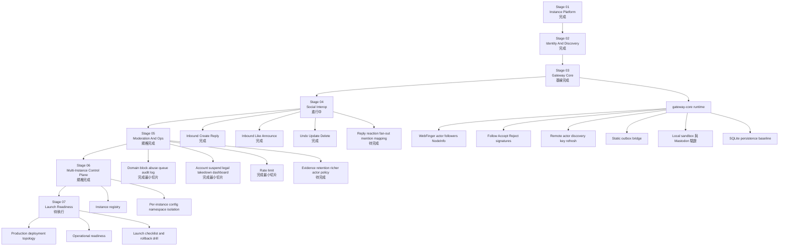

# Matters Instance Interoperability Flow

## Reading Guide

- `Stage 01` 到 `Stage 02` 已完成規格基線
- `Stage 03` 已完成第一版工程基線，`gateway-core runtime`、`Follow inbox`、`signature verification`、`remote actor discovery`、`static outbox bridge`、`SQLite persistence baseline`、`Mastodon sandbox` 驗證已打通
- `Local sandbox verification` 已完成，`Real Mastodon sandbox verification` 也已完成第一輪黑箱驗證
- `Stage 04` 已完成第一批最小控制面，public `Create` / `Reply`、`Like` / `Announce`、`Undo`、outbound `Update` / `Delete` 都已進入工程切片
- `Stage 05` 已有三個 runtime 切片，`domain block`、`abuse queue`、`audit log`、`account suspend`、`legal takedown`、`admin dashboard`、`rate limit` 已打通
- 離正式部署最近的主線是 SQLite persistence 的營運能力、`Stage 05` 剩餘的 evidence retention / richer actor policy，以及 `Stage 04` 的 mention / thread / fan-out
