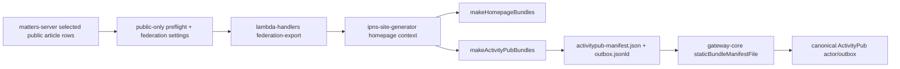

# G2-A Production Data Integration Slice

Status: active preflight
Date: 2026-05-05
Scope: `matters-server`, `lambda-handlers`, `ipns-site-generator`, `gateway-core`

## Objective

Replace fixture-only ActivityPub seed data with selected real Matters public author/article output, while keeping the first engineering slice non-production and reversible. The current architecture keeps public-content eligibility in `matters-server`, moves retryable bundle generation and optional file publication to `lambda-handlers`, keeps static bundle rendering in `ipns-site-generator`, and leaves federation runtime state in `gateway-core`.

## Current Data Chain



The existing production path stops at single article IPFS publication. The ActivityPub seed bundle path exists in `ipns-site-generator`, and gateway ingestion exists in `gateway-core`. Per CTO guidance, `matters-server` should not own retryable bundle generation or file publication; it should own eligibility and source-data boundaries, then hand off async export work to `lambda-handlers`.

## Repo Evidence

| Repo | Evidence | Current status |
|---|---|---|
| `matters-server` | `src/connectors/article/ipfsPublicationService.ts` imports `makeArticlePage` | single article page publishing exists |
| `matters-server` | `src/handlers/ipfsPublication.ts` handles `{ articleId, articleVersionId }` SQS messages | publication worker exists |
| `matters-server` | `src/queries/user/ipnsKey.ts` resolves `user_ipns_keys` | author IPNS identity exists |
| `matters-server` | `src/connectors/article/federationExportService.ts` exposes public-only eligibility and selected article loading | PR [#4761](https://github.com/thematters/matters-server/pull/4761) is review-ready against `develop`; GitHub Actions and Codecov pass |
| `matters-server` | `resolveFederationExportGate` in `src/connectors/article/federationExportService.ts` | G2-B contract scaffold exists in commit `f8d410b`; explicit author opt-in is required, per-article settings are `inherit` / `enabled` / `disabled`, and non-public content cannot be overridden |
| `matters-server` | `db/migrations/20260503000000_create_federation_setting_tables.js` | durable settings schema scaffold exists in commit `af4dffb`; it creates `user_federation_setting` and `article_federation_setting`, but was not run against production |
| `matters-server` | `npm run federation:export -- --enforce-federation-gate` | optional strict mode exists in commit `3497556`; commit `2ae14bf` keeps default DB export migration-safe by joining setting tables only when strict mode is enabled |
| `matters-server` | `decisionReport` in `npm run federation:export` output | export audit summary exists in commit `266a1e1`; it reports selected, eligible, skipped, and per-article gate reasons |
| `matters-server` | `src/connectors/__test__/federationExportService.test.ts` DB loader coverage | commit `9e3ae63` covers migration-safe default export and strict-setting query behavior; local targeted coverage for `federationExportService.ts` is 97.61% lines |
| `matters-server` | `package-lock.json` resolves `@matters/ipns-site-generator@0.1.9` from the npm registry | registry package migration is in the PR; no temporary vendored tarball remains in the current server branch |
| `lambda-handlers` | `handlers/federation-export.ts` | PR [#217](https://github.com/thematters/lambda-handlers/pull/217) is merged; PR [#223](https://github.com/thematters/lambda-handlers/pull/223) removed duplicate manifest output and deployed `v0.14.1` to `federation-export-dev` |
| `ipns-site-generator` | `src/makeHomepage/index.ts` exports `makeActivityPubBundles` | seed generation exists |
| `ipns-site-generator` | `src/types.ts` requires `HomepageContext.byline.author.webfDomain` | canonical host must be provided by caller |
| `ipns-site-generator` | `isFederationPublicArticle` filters explicit paid/private/encrypted/draft/message-like content | static public-only boundary exists |
| `gateway-core` | `static-outbox-bridge.mjs` reads `activitypub-manifest.json` and validates visibility | gateway manifest ingestion exists |
| `gateway-core` | `config.mjs` accepts actor `staticBundleManifestFile` | staging config can point at generated bundle |

## Proposed Non-Production Contract

`matters-server` should emit or expose a selected-author export payload for `lambda-handlers`, and the async worker should emit a bundle with:

```text
index.html
rss.xml
feed.json
.well-known/webfinger
about.jsonld
outbox.jsonld
activitypub-manifest.json
```

The export input should be an allowlisted author and a bounded set of public article IDs. The first slice should run against local/test data or staging-safe data only. For staging, generated files may be returned directly to the caller for inspection; S3 publication is optional and should be enabled only when credentials and bucket policy are ready.

Required `HomepageContext` mapping:

| `HomepageContext` field | Matters source |
|---|---|
| `meta.title` | author display name homepage title |
| `meta.description` | author profile description or generated fallback |
| `meta.image` | author avatar URL |
| `byline.author.userName` | `user.userName` |
| `byline.author.displayName` | `user.displayName` |
| `byline.author.uri` | `https://matters.town/@${userName}` |
| `byline.author.ipnsKey` | `user_ipns_keys.ipnsKey` |
| `byline.author.webfDomain` | G2-A config, eventually `matters.town` |
| `articles[].id` | stable article short hash or canonical slug ID |
| `articles[].title` | latest article version title |
| `articles[].summary` | latest article version summary |
| `articles[].content` | latest public article content HTML |
| `articles[].image` | public cover asset URL |
| `articles[].tags` | article tags |
| `articles[].visibility` | explicit federation visibility marker |
| `articles[].access` | article access/paywall marker |
| `articles[].uri` | canonical Matters article URL |
| `articles[].sourceUri` | same canonical source URL unless overridden |

## Safety Rules

- Default to local/test/staging export only.
- Require explicit author allowlist.
- Treat missing visibility as public only while preserving current G1-A decision; explicit non-public markers must be excluded.
- Do not emit encrypted payload, paywalled body, private content, drafts, direct messages, or circle-only content.
- Do not write production credentials into repo or generated reports.
- Do not deploy or mutate production data in this slice.

## Minimal Implementation Plan

1. Invoke the deployed Lambda with real `matters.icu` rows or DB-backed article IDs, then inspect returned files or S3 output.
2. Add or update a gateway staging fixture/config pointing `staticBundleManifestFile` at the generated manifest.
3. Run `gateway-core` tests against the generated manifest, then run the `matters.icu` Misskey delivery check.
4. Keep production disabled until storage, credentials, rollout timing, legal/privacy, and canonical identity cutover are explicitly approved.

## Local Verification Notes

- `matters-server` work is on branch `codex/g2a-federation-export-preflight`, not on `main`/`develop`.
- Local Node 18.20.8 was installed under the shared tooling directory and `npm ci` passed without rewriting the lockfile.
- `ipns-site-generator` release-readiness verification passed locally: `npm test -- --runInBand` passed 9/9 and `npm run lint` passed.
- `ipns-site-generator` package metadata is prepared as `0.1.9` on branch `codex/release-ipns-activitypub-bundle` commit `0cd6e88`; local tarball `/tmp/matters-ipns-site-generator-0.1.9.tgz` was generated for preflight.
- npm `@matters` scope access was resolved after the initial block; `matters-server` now depends on the registry package in the current PR branch.
- `matters-server` commit `50e2219` added the non-production federation export scaffold, tests, and the original temporary `@matters/ipns-site-generator@0.1.9` tarball dependency; later commits moved the branch to the npm registry package.
- `matters-server` commit `bac7511` added a local bundle writer and path traversal guard for generated output files.
- `matters-server` commit `4761f78` added `npm run federation:export`, supporting JSON fixture input and explicit `--article-id` DB input while keeping credentials in environment variables.
- Public API read selected `mashbean` article `1111146` (`oq72hz05fwnl`) with `state=active` and `access=public`; no private credential was required.
- The generated public-API bundle is stored outside git at `triad-ops/team/artifacts/O-0020/mashbean-public-api-bundle/site`.
- `gateway-core` static bundle bridge successfully read that generated `activitypub-manifest.json` and normalized one `Article` item for `https://staging-gateway.matters.town/users/mashbean`.
- `gateway-core` local SQLite runtime started with `triad-ops/team/artifacts/O-0020/mashbean-public-api-bundle/gateway-local.instance.json` after rebuilding `better-sqlite3`.
- Local HTTP probes passed: WebFinger resolved `acct:mashbean@staging-gateway.matters.town`, `/users/mashbean` returned `Person`, and `/users/mashbean/outbox` returned one `Article`.
- Public API read selected `charlesmungerai` articles `1182465` (`wdzgj6wllhrf`), `1181808` (`mgbaikfdg7a9`), and `1181797` (`drxqcpmy0obk`) with `state=active` and `access=public`; no private credential was required.
- The generated `charlesmungerai` bundle is stored outside git at `triad-ops/team/artifacts/O-0020/charlesmungerai-public-api-bundle/site`.
- Local HTTP probes passed: WebFinger resolved `acct:charlesmungerai@staging-gateway.matters.town`, `/users/charlesmungerai` returned `Person`, and `/users/charlesmungerai/outbox` returned three `Article` items.
- The generated `charlesmungerai` bundle was exposed through the existing local Cloudflare Tunnel staging hostname. Public probes passed for WebFinger, actor, and outbox; `staging-admin` still returned `admin_local_only`.
- Misskey public interop on gyutte.site resolved and followed `charlesmungerai@staging-gateway.matters.town`. Existing generated outbox Articles were not backfilled into `users/notes`.
- A fresh gateway `outbox/create` delivery for public Matters article `1182465` reached the gyutte.site follower with status `delivered`, and Misskey `users/notes` matched the Article object.
- `matters-server` commit `f8d410b` added a local G2-B eligibility gate scaffold and `docs/Federation-Export.md`; verification passed with Node 18 build, targeted federationExportService Jest 9/9, targeted ESLint, `git diff --check`, and the repository pre-commit hook.
- `matters-server` commit `af4dffb` added the durable federation settings migration scaffold and row-level contract fields; verification passed with Node 18 build, targeted federationExportService Jest 10/10, targeted ESLint, `git diff --check`, and the repository pre-commit hook.
- `matters-server` commit `3497556` wired the strict gate into the exporter behind an explicit CLI flag / env var; verification passed with Node 18 build, targeted federationExportService Jest 12/12, targeted ESLint, `git diff --check`, and the repository pre-commit hook.
- `matters-server` commit `2ae14bf` fixed the default DB export path so environments without the new settings migration can still run non-strict exports; verification passed with Node 18 build, targeted federationExportService Jest 12/12, targeted ESLint, `git diff --check`, CLI help output, and the repository pre-commit hook.
- `matters-server` commit `266a1e1` added export decision reporting; verification passed with Node 18 build, targeted federationExportService Jest 13/13, targeted ESLint, `git diff --check`, CLI fixture export, and the repository pre-commit hook.
- `matters-server` commit `cfd0cb6` added patch-coverage tests for `federationExportService.ts` and the federation settings migration. GitHub Actions build and Codecov patch/project checks now pass on PR #4761.
- `lambda-handlers` PR #217 merged the federation export handler. Build & Test passed; the post-merge ECR image publish failed because immutable tag `v0.13.5` already exists, so deployment needs a fresh version/tag or workflow retry strategy.
- `ipns-site-generator` PR #161 merged to `main` on 2026-05-11.
- `matters-server` PR #4761 merged to `develop` on 2026-05-11; the post-merge develop deploy and schema workflow passed for `matters.icu`.
- Local `matters.icu` staging dry-run through the lambda handler passed with real public API rows: article `23520` was eligible, paywalled article `23522` was skipped as `article_not_public`, and the generated bundle contained seven unique files after the manifest de-duplication fix.
- `lambda-handlers` PR #223 merged on 2026-05-11. Build & Deploy passed, ECR image `v0.14.1` was published, `federation-export-dev` was updated, and the provision workflow fixture smoke test passed.
- `gateway-core` local `better-sqlite3` native module was rebuilt for Node 18 and the full test suite passed 117/117.
- `matters-fediverse-gateway` PR #5 was merged into `main`; `git diff --check` and `triad-ops` validation passed at that handoff.

## Blocked Human Decisions

- Which pilot authors are selected.
- Whether federation is default-off or default-on after author opt-in.
- Exact per-article federation setting copy and behavior.
- When `acct:user@matters.town` becomes public canonical identity.
- Production storage target and credentials.
- Legal/privacy readiness for beta.

## Next Engineering Action

The next end-to-end staging pass should use explicit public article IDs or real `matters.icu` rows, confirm the decision report, run deployed Lambda bundle generation, inspect returned files or S3 output, ingest the manifest into the staging gateway, and deliver one public Article to gyutte.site Misskey.
