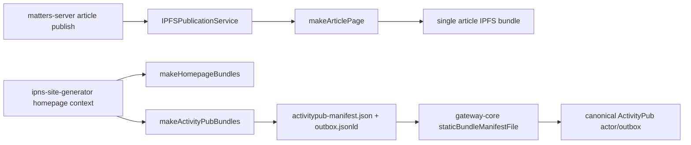

# G2-A Production Data Integration Slice

Status: active preflight  
Date: 2026-05-02  
Scope: `matters-server`, `ipns-site-generator`, `gateway-core`

## Objective

Replace fixture-only ActivityPub seed data with selected real Matters public author/article output, while keeping the first engineering slice non-production and reversible.

## Current Data Chain



The existing production path stops at single article IPFS publication. The ActivityPub seed bundle path exists in `ipns-site-generator`, and gateway ingestion exists in `gateway-core`, but `matters-server` does not yet produce the homepage/ActivityPub bundle from real article data.

## Repo Evidence

| Repo | Evidence | Current status |
|---|---|---|
| `matters-server` | `src/connectors/article/ipfsPublicationService.ts` imports `makeArticlePage` | single article page publishing exists |
| `matters-server` | `src/handlers/ipfsPublication.ts` handles `{ articleId, articleVersionId }` SQS messages | publication worker exists |
| `matters-server` | `src/queries/user/ipnsKey.ts` resolves `user_ipns_keys` | author IPNS identity exists |
| `matters-server` | `src/connectors/article/federationExportService.ts` imports `makeHomepageBundles` / `makeActivityPubBundles` and writes bundle files to a caller-provided output directory | non-production ActivityPub export scaffold exists in commit `50e2219`; local writer exists in commit `bac7511` |
| `matters-server` | `package-lock.json` resolves `@matters/ipns-site-generator@0.1.9` from `vendor/matters-ipns-site-generator-0.1.9.tgz` | temporary bridge until npm `@matters` scope publish permission is available |
| `ipns-site-generator` | `src/makeHomepage/index.ts` exports `makeActivityPubBundles` | seed generation exists |
| `ipns-site-generator` | `src/types.ts` requires `HomepageContext.byline.author.webfDomain` | canonical host must be provided by caller |
| `ipns-site-generator` | `isFederationPublicArticle` filters explicit paid/private/encrypted/draft/message-like content | static public-only boundary exists |
| `gateway-core` | `static-outbox-bridge.mjs` reads `activitypub-manifest.json` and validates visibility | gateway manifest ingestion exists |
| `gateway-core` | `config.mjs` accepts actor `staticBundleManifestFile` | staging config can point at generated bundle |

## Proposed Non-Production Contract

`matters-server` should emit a selected-author bundle with:

```text
index.html
rss.xml
feed.json
.well-known/webfinger
about.jsonld
outbox.jsonld
activitypub-manifest.json
```

The export input should be an allowlisted author and a bounded set of public article IDs. The first slice should run against local/test data or staging-safe data only.

Required `HomepageContext` mapping:

| `HomepageContext` field | Matters source |
|---|---|
| `meta.title` | author display name homepage title |
| `meta.description` | author profile description or generated fallback |
| `meta.image` | author avatar URL |
| `byline.author.userName` | `user.userName` |
| `byline.author.displayName` | `user.displayName` |
| `byline.author.uri` | `https://matters.town/@${userName}` |
| `byline.author.ipnsKey` | `user_ipns_keys.ipnsKey` |
| `byline.author.webfDomain` | G2-A config, eventually `matters.town` |
| `articles[].id` | stable article short hash or canonical slug ID |
| `articles[].title` | latest article version title |
| `articles[].summary` | latest article version summary |
| `articles[].content` | latest public article content HTML |
| `articles[].image` | public cover asset URL |
| `articles[].tags` | article tags |
| `articles[].visibility` | explicit federation visibility marker |
| `articles[].access` | article access/paywall marker |
| `articles[].uri` | canonical Matters article URL |
| `articles[].sourceUri` | same canonical source URL unless overridden |

## Safety Rules

- Default to local/test/staging export only.
- Require explicit author allowlist.
- Treat missing visibility as public only while preserving current G1-A decision; explicit non-public markers must be excluded.
- Do not emit encrypted payload, paywalled body, private content, drafts, direct messages, or circle-only content.
- Do not write production credentials into repo or generated reports.
- Do not deploy or mutate production data in this slice.

## Minimal Implementation Plan

1. Keep the committed temporary vendored tarball dependency only while npm `@matters` scope publish permission is unavailable.
2. Publish `@matters/ipns-site-generator@0.1.9` when permission arrives, then migrate `matters-server` to `^0.1.9` and remove the vendored tarball.
3. Use the committed `matters-server` mapper/service for `HomepageContext` from explicitly selected public article rows.
4. Wrap the committed local writer in a CLI or worker mode once staging-safe article IDs and runtime credentials are available.
5. Add a gateway staging fixture or config example pointing `staticBundleManifestFile` at that directory.
6. Run `ipns-site-generator` tests and `gateway-core` tests against the generated manifest.

## Local Verification Notes

- `matters-server` work is on branch `codex/g2a-federation-export-preflight`, not on `main`/`develop`.
- Local Node 18.20.8 was installed under the shared tooling directory and `npm ci` passed without rewriting the lockfile.
- `ipns-site-generator` release-readiness verification passed locally: `npm test -- --runInBand` passed 9/9 and `npm run lint` passed.
- `ipns-site-generator` package metadata is prepared as `0.1.9` on branch `codex/release-ipns-activitypub-bundle` commit `0cd6e88`; local tarball `/tmp/matters-ipns-site-generator-0.1.9.tgz` was generated for preflight.
- Direct npm publish is blocked by missing `@matters` scope permission. A temporary granular npm token was created and saved outside git, but it still cannot publish the scoped package.
- `matters-server` commit `50e2219` added the non-production federation export scaffold, tests, and temporary vendored `@matters/ipns-site-generator@0.1.9` tarball dependency.
- `matters-server` commit `bac7511` added a local bundle writer and path traversal guard for generated output files.
- `matters-server` verification passed: `npm run build`, targeted `federationExportService` Jest 7/7, targeted ESLint, `git diff --check`, and commit hook build/gen/lint/prettier checks.

## Blocked Human Decisions

- Which pilot authors are selected.
- Whether federation is default-off or default-on after author opt-in.
- Exact per-article federation setting copy and behavior.
- When `acct:user@matters.town` becomes public canonical identity.
- Production storage target and credentials.
- Legal/privacy readiness for beta.

## Next Engineering Action

Use the committed non-production exporter scaffold and local writer to produce a selected-author staging bundle when staging-safe article IDs and runtime credentials are available. After npm `@matters` scope permission arrives, publish `@matters/ipns-site-generator@0.1.9`, migrate `matters-server` from the vendored tarball to `^0.1.9`, and rerun the same Node 18 checks before any staging deployment.
