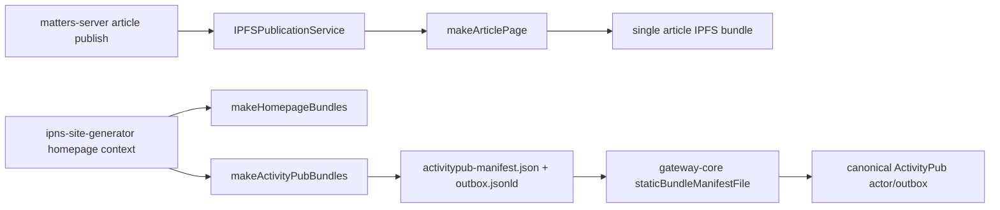

# G2-A Production Data Integration Slice

Status: active preflight  
Date: 2026-05-02  
Scope: `matters-server`, `ipns-site-generator`, `gateway-core`

## Objective

Replace fixture-only ActivityPub seed data with selected real Matters public author/article output, while keeping the first engineering slice non-production and reversible.

## Current Data Chain



The existing production path stops at single article IPFS publication. The ActivityPub seed bundle path exists in `ipns-site-generator`, and gateway ingestion exists in `gateway-core`, but `matters-server` does not yet produce the homepage/ActivityPub bundle from real article data.

## Repo Evidence

| Repo | Evidence | Current status |
|---|---|---|
| `matters-server` | `src/connectors/article/ipfsPublicationService.ts` imports `makeArticlePage` | single article page publishing exists |
| `matters-server` | `src/handlers/ipfsPublication.ts` handles `{ articleId, articleVersionId }` SQS messages | publication worker exists |
| `matters-server` | `src/queries/user/ipnsKey.ts` resolves `user_ipns_keys` | author IPNS identity exists |
| `matters-server` | `src/connectors/article/federationExportService.ts` imports `makeHomepageBundles` / `makeActivityPubBundles` and writes bundle files to a caller-provided output directory | non-production ActivityPub export scaffold exists in commit `50e2219`; local writer exists in commit `bac7511`; CLI exists in commit `4761f78` |
| `matters-server` | `resolveFederationExportGate` in `src/connectors/article/federationExportService.ts` | G2-B contract scaffold exists in commit `f8d410b`; explicit author opt-in is required, per-article settings are `inherit` / `enabled` / `disabled`, and non-public content cannot be overridden |
| `matters-server` | `db/migrations/20260503000000_create_federation_setting_tables.js` | durable settings schema scaffold exists in commit `af4dffb`; it creates `user_federation_setting` and `article_federation_setting`, but was not run against production |
| `matters-server` | `npm run federation:export -- --enforce-federation-gate` | optional strict mode exists in commit `3497556`; commit `2ae14bf` keeps default DB export migration-safe by joining setting tables only when strict mode is enabled |
| `matters-server` | `decisionReport` in `npm run federation:export` output | export audit summary exists in commit `266a1e1`; it reports selected, eligible, skipped, and per-article gate reasons |
| `matters-server` | `src/connectors/__test__/federationExportService.test.ts` DB loader coverage | commit `9e3ae63` covers migration-safe default export and strict-setting query behavior; local targeted coverage for `federationExportService.ts` is 97.61% lines |
| `matters-server` | `package-lock.json` resolves `@matters/ipns-site-generator@0.1.9` from `vendor/matters-ipns-site-generator-0.1.9.tgz` | temporary bridge until npm `@matters` scope publish permission is available |
| `ipns-site-generator` | `src/makeHomepage/index.ts` exports `makeActivityPubBundles` | seed generation exists |
| `ipns-site-generator` | `src/types.ts` requires `HomepageContext.byline.author.webfDomain` | canonical host must be provided by caller |
| `ipns-site-generator` | `isFederationPublicArticle` filters explicit paid/private/encrypted/draft/message-like content | static public-only boundary exists |
| `gateway-core` | `static-outbox-bridge.mjs` reads `activitypub-manifest.json` and validates visibility | gateway manifest ingestion exists |
| `gateway-core` | `config.mjs` accepts actor `staticBundleManifestFile` | staging config can point at generated bundle |

## Proposed Non-Production Contract

`matters-server` should emit a selected-author bundle with:

```text
index.html
rss.xml
feed.json
.well-known/webfinger
about.jsonld
outbox.jsonld
activitypub-manifest.json
```

The export input should be an allowlisted author and a bounded set of public article IDs. The first slice should run against local/test data or staging-safe data only.

Required `HomepageContext` mapping:

| `HomepageContext` field | Matters source |
|---|---|
| `meta.title` | author display name homepage title |
| `meta.description` | author profile description or generated fallback |
| `meta.image` | author avatar URL |
| `byline.author.userName` | `user.userName` |
| `byline.author.displayName` | `user.displayName` |
| `byline.author.uri` | `https://matters.town/@${userName}` |
| `byline.author.ipnsKey` | `user_ipns_keys.ipnsKey` |
| `byline.author.webfDomain` | G2-A config, eventually `matters.town` |
| `articles[].id` | stable article short hash or canonical slug ID |
| `articles[].title` | latest article version title |
| `articles[].summary` | latest article version summary |
| `articles[].content` | latest public article content HTML |
| `articles[].image` | public cover asset URL |
| `articles[].tags` | article tags |
| `articles[].visibility` | explicit federation visibility marker |
| `articles[].access` | article access/paywall marker |
| `articles[].uri` | canonical Matters article URL |
| `articles[].sourceUri` | same canonical source URL unless overridden |

## Safety Rules

- Default to local/test/staging export only.
- Require explicit author allowlist.
- Treat missing visibility as public only while preserving current G1-A decision; explicit non-public markers must be excluded.
- Do not emit encrypted payload, paywalled body, private content, drafts, direct messages, or circle-only content.
- Do not write production credentials into repo or generated reports.
- Do not deploy or mutate production data in this slice.

## Minimal Implementation Plan

1. Keep the committed temporary vendored tarball dependency only while npm `@matters` scope publish permission is unavailable.
2. Publish `@matters/ipns-site-generator@0.1.9` when permission arrives, then migrate `matters-server` to `^0.1.9` and remove the vendored tarball.
3. Use the committed `matters-server` mapper/service for `HomepageContext` from explicitly selected public article rows.
4. Use the committed CLI in fixture mode for public API snapshots, or `--article-id` mode when read-only staging DB credentials are available.
5. Add a gateway staging fixture or config example pointing `staticBundleManifestFile` at that directory.
6. Run `ipns-site-generator` tests and `gateway-core` tests against the generated manifest.

## Local Verification Notes

- `matters-server` work is on branch `codex/g2a-federation-export-preflight`, not on `main`/`develop`.
- Local Node 18.20.8 was installed under the shared tooling directory and `npm ci` passed without rewriting the lockfile.
- `ipns-site-generator` release-readiness verification passed locally: `npm test -- --runInBand` passed 9/9 and `npm run lint` passed.
- `ipns-site-generator` package metadata is prepared as `0.1.9` on branch `codex/release-ipns-activitypub-bundle` commit `0cd6e88`; local tarball `/tmp/matters-ipns-site-generator-0.1.9.tgz` was generated for preflight.
- Direct npm publish is blocked by missing `@matters` scope permission. A temporary granular npm token was created and saved outside git, but it still cannot publish the scoped package.
- `matters-server` commit `50e2219` added the non-production federation export scaffold, tests, and temporary vendored `@matters/ipns-site-generator@0.1.9` tarball dependency.
- `matters-server` commit `bac7511` added a local bundle writer and path traversal guard for generated output files.
- `matters-server` commit `4761f78` added `npm run federation:export`, supporting JSON fixture input and explicit `--article-id` DB input while keeping credentials in environment variables.
- Public API read selected `mashbean` article `1111146` (`oq72hz05fwnl`) with `state=active` and `access=public`; no private credential was required.
- The generated public-API bundle is stored outside git at `triad-ops/team/artifacts/O-0020/mashbean-public-api-bundle/site`.
- `gateway-core` static bundle bridge successfully read that generated `activitypub-manifest.json` and normalized one `Article` item for `https://staging-gateway.matters.town/users/mashbean`.
- `gateway-core` local SQLite runtime started with `triad-ops/team/artifacts/O-0020/mashbean-public-api-bundle/gateway-local.instance.json` after rebuilding `better-sqlite3`.
- Local HTTP probes passed: WebFinger resolved `acct:mashbean@staging-gateway.matters.town`, `/users/mashbean` returned `Person`, and `/users/mashbean/outbox` returned one `Article`.
- Public API read selected `charlesmungerai` articles `1182465` (`wdzgj6wllhrf`), `1181808` (`mgbaikfdg7a9`), and `1181797` (`drxqcpmy0obk`) with `state=active` and `access=public`; no private credential was required.
- The generated `charlesmungerai` bundle is stored outside git at `triad-ops/team/artifacts/O-0020/charlesmungerai-public-api-bundle/site`.
- Local HTTP probes passed: WebFinger resolved `acct:charlesmungerai@staging-gateway.matters.town`, `/users/charlesmungerai` returned `Person`, and `/users/charlesmungerai/outbox` returned three `Article` items.
- The generated `charlesmungerai` bundle was exposed through the existing local Cloudflare Tunnel staging hostname. Public probes passed for WebFinger, actor, and outbox; `staging-admin` still returned `admin_local_only`.
- Misskey public interop on gyutte.site resolved and followed `charlesmungerai@staging-gateway.matters.town`. Existing generated outbox Articles were not backfilled into `users/notes`.
- A fresh gateway `outbox/create` delivery for public Matters article `1182465` reached the gyutte.site follower with status `delivered`, and Misskey `users/notes` matched the Article object.
- `matters-server` commit `f8d410b` added a local G2-B eligibility gate scaffold and `docs/Federation-Export.md`; verification passed with Node 18 build, targeted federationExportService Jest 9/9, targeted ESLint, `git diff --check`, and the repository pre-commit hook.
- `matters-server` commit `af4dffb` added the durable federation settings migration scaffold and row-level contract fields; verification passed with Node 18 build, targeted federationExportService Jest 10/10, targeted ESLint, `git diff --check`, and the repository pre-commit hook.
- `matters-server` commit `3497556` wired the strict gate into the exporter behind an explicit CLI flag / env var; verification passed with Node 18 build, targeted federationExportService Jest 12/12, targeted ESLint, `git diff --check`, and the repository pre-commit hook.
- `matters-server` commit `2ae14bf` fixed the default DB export path so environments without the new settings migration can still run non-strict exports; verification passed with Node 18 build, targeted federationExportService Jest 12/12, targeted ESLint, `git diff --check`, CLI help output, and the repository pre-commit hook.
- `matters-server` commit `266a1e1` added export decision reporting; verification passed with Node 18 build, targeted federationExportService Jest 13/13, targeted ESLint, `git diff --check`, CLI fixture export, and the repository pre-commit hook.
- `matters-server` commit `9e3ae63` added DB loader tests for default migration-safe export and strict federation setting joins; verification passed with Node 18 build, targeted federation export Jest 18/18, targeted ESLint, `git diff --check`, and commit hook build/gen/lint/prettier checks. Local targeted coverage for `federationExportService.ts` is 97.61% lines.
- `gateway-core` local `better-sqlite3` native module was rebuilt for Node 18 and the full test suite passed 117/117.
- `matters-fediverse-gateway` draft PR #5 was rebased onto `origin/main`; `git diff --check` and `triad-ops` validation passed.

## Blocked Human Decisions

- Which pilot authors are selected.
- Whether federation is default-off or default-on after author opt-in.
- Exact per-article federation setting copy and behavior.
- When `acct:user@matters.town` becomes public canonical identity.
- Production storage target and credentials.
- Legal/privacy readiness for beta.

## Next Engineering Action

Wait for `matters-server` PR #4761 CI/Codecov. If Codecov still fails, add focused tests around the reported lines. Keep npm registry migration deferred: after npm `@matters` scope permission arrives, publish `@matters/ipns-site-generator@0.1.9`, migrate `matters-server` from the vendored tarball to `^0.1.9`, and rerun the same Node 18 checks before any staging deployment. In parallel, continue G2-B contract scaffolding locally: author opt-in state, per-article federation setting shape, export trigger boundaries, and admin/review surfaces.
