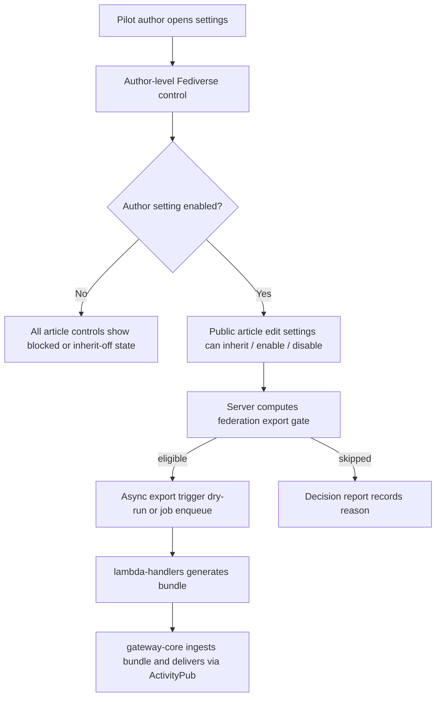

# G2-B Product Contract Slice

Date: 2026-05-11
Status: contract scaffold active; no production rollout

## Goal

G2-B turns the working export path into a product surface that selected Matters
authors can understand and control.

This slice does not enable production federation. It defines the contract for
author opt-in, per-article behavior, export triggers, and product copy so
`matters-web`, `matters-server`, and `gateway-core` can move in the same
direction.

## Repo-Backed Starting Point

| Repo | Existing evidence | Current meaning |
| --- | --- | --- |
| `matters-server` | `docs/Federation-Export.md` | Server owns public-only eligibility, author/article settings, and decision reports. |
| `matters-server` | `src/connectors/article/federationExportService.ts` | `resolveFederationExportGate` requires explicit author opt-in and blocks non-public content. |
| `matters-server` | `src/types/system.ts` | Admin-only setting mutations and enum states already exist. |
| `matters-web` | `src/views/Me/Settings/Misc/index.tsx` | Account settings page is the lowest-friction author-level UI entry point. |
| `matters-web` | `src/views/ArticleDetail/Edit/OptionContent/index.tsx` | Article edit `Settings` tab is the natural per-article control entry point. |
| `matters-web` | `src/views/ArticleDetail/Edit/gql.ts` | Edit article query is where article federation fields should be read. |
| `gateway-core` | SQLite runtime and public staging probes | Gateway does not need new UI state for the first G2-B slice; it consumes export output and records delivery state. |

## Recommended State Model

Author setting:

| State | Meaning |
| --- | --- |
| missing | Treated as `disabled`. This is the default. |
| `disabled` | No article from the author is federated. |
| `enabled` | Public eligible articles may federate unless the article disables it. |

Article setting:

| State | Meaning |
| --- | --- |
| missing | Treated as `inherit`. |
| `inherit` | Follow author setting. |
| `enabled` | Allow this public article only if author setting is enabled. |
| `disabled` | Block this article. |

Non-public boundary:

- `paid`, encrypted, private, archived, draft, missing-author-identity, or
  message-like content remains blocked even if settings are `enabled`.
- Paywall/private blocks must be decided server-side, not by matters-web.

## Product Flow



## API Contract Needed Next

Read fields:

```graphql
type UserFederationSetting {
  userId: ID!
  state: FederationAuthorSettingState!
  updatedBy: ID
}

type ArticleFederationSetting {
  articleId: ID!
  state: FederationArticleSettingState!
  updatedBy: ID
}
```

Recommended additions:

```graphql
extend type User {
  federationSetting: UserFederationSetting
  federationEligible: Boolean!
}

extend type Article {
  federationSetting: ArticleFederationSetting
  federationEligibility: ArticleFederationEligibility!
}

type ArticleFederationEligibility {
  eligible: Boolean!
  reason: FederationExportDecisionReason!
  effectiveArticleSetting: FederationArticleSettingState!
}
```

Mutation policy:

- Existing admin-only mutations remain for staging/internal setup.
- Add user-facing mutations only after pilot gating is defined.
- User-facing author mutation can only update the viewer's own author setting.
- User-facing article mutation can only update an article owned by the viewer.
- Both mutations must return the computed effective state or eligibility reason.

## Export Trigger Boundary

First implementation should be dry-run capable:

| Event | Behavior before production |
| --- | --- |
| Author toggles setting | Record setting; do not publish existing backlog automatically. |
| Public article published | Compute decision report; enqueue export only in staging/pilot mode. |
| Public article edited | Compute decision report; enqueue update only in staging/pilot mode. |
| Article becomes non-public | Record skip reason and later enqueue delete/update only after production deletion policy is approved. |
| Article setting disabled | Stop future export; deletion/update behavior remains a rollout/legal decision. |

The safe next engineering slice is a server-side dry-run trigger that records
the decision report without writing S3, sending ActivityPub, or changing
production data.

## Product Copy

Author settings:

```text
Fediverse
讓其他 Fediverse 服務追蹤你的公開文章。付費、加密、私人與草稿內容不會送出。
```

Article settings:

```text
同步到 Fediverse
跟隨帳號設定
允許這篇文章同步
不要同步這篇文章
```

Disabled reason:

```text
這篇文章目前不能同步。只有公開、已發布、作者身分正常的文章可以送到 Fediverse。
```

Beta warning:

```text
這是測試功能。同步後，公開文章與互動可能會出現在其他 Fediverse 服務。
```

## Implementation Order

1. Add read-side federation setting and eligibility fields in `matters-server`.
2. Add pilot-scoped user-facing setting mutations in `matters-server`.
3. Add account-level control in `matters-web`.
4. Add per-article control in `matters-web`.
5. Add export-trigger dry-run and decision audit in `matters-server` or
   `lambda-handlers`.
6. Re-run `matters.icu` staging public-only and strict-gate checks.
7. Gate production rollout on legal/privacy, pilot author approval, storage, and
   canonical identity cutover.

## Current Human Decisions

Recommended defaults:

- Author federation default: off.
- First beta: pilot allowlist only.
- Article default: inherit.
- Individual article force-enable: allowed only when author is enabled.
- Existing article backlog: do not auto-export on opt-in until a separate pilot
  action is approved.

Still needs human approval before production:

- Pilot author list.
- Final copy.
- Backfill policy for existing public articles.
- Delete/update behavior when an already federated article becomes non-public.
- Legal/privacy approval.
