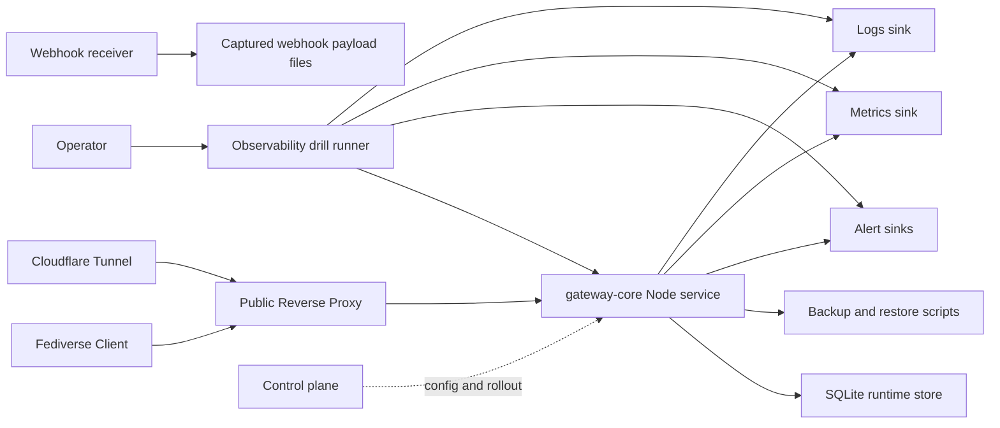

# Deployment Topology Baseline

## Goal

把 `Stage 03` 的 deployment topology 固化成最小可溝通 artifact，讓 staging drill、reverse proxy、runtime store 與外部 observability sink 有同一張基準圖。

## Baseline Topology

## Baseline Artifacts

- `gateway-core/config/staging.instance.example.json`
  staging config 範本，收斂 SQLite、alerting、metrics、logs dispatch 基線
- `gateway-core/config/staging.secrets.example/README.md`
  staging secret file layout 範本
- `gateway-core/deploy/Caddyfile.example`
  public reverse proxy 的最小 baseline
- `gateway-core/deploy/cloudflared-staging.example.yml`
  既有 Cloudflare 帳號可用的 staging Tunnel ingress 範本
- `gateway-core/deploy/Caddyfile.cloudflare-tunnel.example`
  Tunnel 後方的 staging reverse proxy，公開 hostname 擋 `/admin` 與 `/jobs`
- `gateway-core/scripts/check-secret-layout.mjs`
  檢查 config 內 `*File` 參考是否存在
- `gateway-core/scripts/run-webhook-receiver.mjs`
  免費自架 generic webhook receiver，接收 staging alerts / metrics / logs payload
- `gateway-core/scripts/run-staging-observability-drill.mjs`
  一次驗證 alerts、metrics、logs 外部接線
- `research/matters-fediverse-compat/03-ops/staging-cloudflare-tunnel-runbook.md`
  Cloudflare Tunnel staging 入口、webhook receiver 與 drill report 命名規則
- `research/matters-fediverse-compat/03-ops/restore-replay-drill-runbook.md`
  restore / replay 與 observability drill 的操作順序

## Remaining Gaps

- 真實 deployment secret file 還沒 provision
- Cloudflare Tunnel、DNS hostname、Access policy 還沒由帳號持有人建立
- 真實 staging drill 尚未用公開 hostname 實跑並封存報告
- control plane 與 gateway-core 的 rollout boundary 仍待 runtime 化
